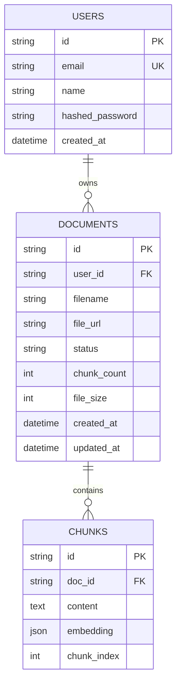

# KnlHub - AI 智能知识库管理系统

<p align="center">
  上传文档 → 自动解析向量化 → 自然语言对话查询
</p>

<p align="center">
  
  
  
  
</p>

---

## 项目简介

KnlHub 是一款基于 **RAG（Retrieval-Augmented Generation，检索增强生成）** 架构的 AI 知识库管理系统。用户可上传文档（PDF、Word、Markdown、Excel 等），系统自动将文档内容解析、分块并向量化存储，随后通过自然语言对话的方式查询知识库中的内容。

### 核心特性

- 多格式文档上传：PDF、Word、Markdown、TXT、CSV、Excel
- 自动文本解析与智能分块（可配置 chunk_size 和 overlap）
- AI Embedding 向量化存储，支持向量相似度检索
- 自然语言对话式知识查询
- 多模型支持：通义千问、智谱、DeepSeek、Kimi、月之暗面
- JWT 认证，多用户独立知识库隔离
- Redis 缓存热门查询，减少 API 费用
- 现代化 UI，清爽的 SaaS 风格界面

### 技术架构

```
┌─────────────┐     REST API     ┌──────────────────┐
│   Frontend  │ ────────────────▶ │     Backend      │
│  React + TS │                  │     FastAPI      │
│  TailwindCSS│ ◀─────────────── │  + SQLAlchemy    │
│  Zustand    │   JSON Response   │  + AsyncIO       │
└─────────────┘                  └────────┬─────────┘
                                          │
                    ┌─────────────────────┼─────────────────────┐
                    ▼                     ▼                     ▼
              ┌──────────┐         ┌──────────┐          ┌──────────┐
              │PostgreSQL│         │  Redis   │          │ AI API   │
              │+ pgvector│         │  (Cache) │          │(Embedding│
              └──────────         └──────────┘          │  + LLM)  │
                                                         └──────────┘
```

### 技术栈

| 层级 | 技术 |
|------|------|
| **前端** | React 18, TypeScript, Vite 6, TailwindCSS 3, Zustand, Axios, React Router 6, Lucide Icons |
| **后端** | FastAPI, SQLAlchemy 2.0 (Async), Uvicorn, Pydantic, passlib+bcrypt, python-jose |
| **数据库** | PostgreSQL + pgvector（生产）, SQLite（本地开发） |
| **缓存** | Redis 7 |
| **AI 服务** | 通义千问, 智谱 AI, DeepSeek, Kimi, 月之暗面 |
| **文档解析** | pdfplumber, python-docx, openpyxl, beautifulsoup4, pypdf |
| **部署** | Docker, Docker Compose, Nginx |

---

## 快速开始

### 前置条件

- Node.js >= 20
- Python >= 3.11
- PostgreSQL >= 15（可选，默认使用 SQLite）
- Redis（可选）
- 至少一个 AI API Key（通义千问 / DeepSeek / 智谱等）

### 1. 克隆项目

```bash
git clone https://github.com/deweitang27-coder/knlhub.git
cd knlhub
```

### 2. 后端启动

```bash
cd backend

# 创建虚拟环境
python -m venv venv
source venv/bin/activate  # Linux/Mac
# 或 venv\Scripts\activate  # Windows

# 安装依赖
pip install -r requirements.txt

# 复制环境变量
cp .env.example .env  # 或直接编辑 .env

# 启动服务
uvicorn app.main:app --reload --host 0.0.0.0 --port 8000
```

后端服务运行在 http://localhost:8000

### 3. 前端启动

```bash
cd frontend

# 安装依赖
npm install

# 启动开发服务器
npm run dev
```

前端服务运行在 http://localhost:3000

### 4. 环境变量配置

编辑 `backend/.env` 文件：

```env
# 数据库（默认 SQLite，无需额外配置）
DB_TYPE=sqlite
# 使用 PostgreSQL 时：
# DB_TYPE=postgres
# DB_HOST=localhost
# DB_PORT=5432
# DB_USER=postgres
# DB_PASSWORD=postgres
# DB_NAME=ai_knowledge_base

# Redis（可选）
REDIS_HOST=localhost
REDIS_PORT=6379

# JWT 密钥（生产环境务必修改）
JWT_SECRET_KEY=your-secret-key-here

# Embedding 模型配置
EMBEDDING_PROVIDER=tongyi
EMBEDDING_MODEL=text-embedding-v3
EMBEDDING_API_KEY=sk-your-api-key
EMBEDDING_BASE_URL=https://dashscope.aliyuncs.com/compatible-mode/v1

# LLM 对话模型配置
LLM_PROVIDER=deepseek
LLM_MODEL=deepseek-chat
LLM_API_KEY=sk-your-api-key
LLM_BASE_URL=https://api.deepseek.com/v1

# RAG 参数
CHUNK_SIZE=512
CHUNK_OVERLAP=64
TOP_K=5
MAX_FILE_SIZE=52428800
```

### 5. 支持的 AI 服务商

| 服务商 | 类型 | Base URL | 推荐模型 |
|--------|------|----------|----------|
| 通义千问 | Embedding + LLM | `https://dashscope.aliyuncs.com/compatible-mode/v1` | text-embedding-v3, qwen-plus |
| 智谱 AI | Embedding + LLM | `https://open.bigmodel.cn/api/paas/v4` | embedding-3, glm-4 |
| DeepSeek | LLM | `https://api.deepseek.com/v1` | deepseek-chat |
| Kimi | LLM | `https://api.moonshot.cn/v1` | kimi-chat |
| 月之暗面 | LLM | `https://api.moonshot.cn/v1` | moonshot-v1-8k |

---

## 部署方案

### 方案一：Docker Compose 一键部署（推荐生产环境）

使用 Docker Compose 可一键启动完整服务栈（PostgreSQL + Redis + 后端 + 前端）：

```bash
# 项目根目录
cd ai-knowledge-base

# 创建 .env 文件
cp .env.example .env
# 编辑 .env 填入你的配置

# 一键启动
docker compose up -d

# 查看日志
docker compose logs -f

# 停止服务
docker compose down
```

服务端口：
- 前端：http://localhost:3000
- 后端 API：http://localhost:8000
- PostgreSQL：localhost:5432
- Redis：localhost:6379

#### Docker Compose 架构

```
┌──────────────┐
│    Nginx     │ :3000 → 前端静态资源
└──────────────┘
       │
┌──────────────┐
│    Backend   │ :8000 → FastAPI + Uvicorn
└──────────────┘
       │
  ┌────┴──────────────┬──────────┐
  ▼         ▼          ▼          ▼
┌──────┐ ┌────── ┌────────┐ ┌─────────┐
│Postgre│ │Redis │ │uploads │ │ AI API  │
│SQL   │ │      │ │(volume)│ │(external)│
└──────┘ └──────┘ └────────┘ └─────────┘
```

### 方案二：本地开发模式

适合开发调试，后端热重载，前端 Vite HMR：

```bash
# 终端1：启动后端
cd backend && uvicorn app.main:app --reload --port 8000

# 终端2：启动前端
cd frontend && npm run dev
```

前端通过 Vite 代理将 `/api` 请求转发到后端：

```js
// vite.config.ts
export default {
  server: {
    proxy: {
      '/api': {
        target: 'http://localhost:8000',
        changeOrigin: true,
      },
    },
  },
}
```

### 方案三：使用 WSL / Linux 服务器部署

适合部署到云服务器或本地 WSL 环境：

```bash
# 安装 PostgreSQL + pgvector
sudo apt update
sudo apt install postgresql postgresql-contrib

# 启用 pgvector 扩展
sudo -u postgres psql -c "CREATE EXTENSION IF NOT EXISTS vector;"

# 安装 Redis
sudo apt install redis-server
sudo systemctl start redis

# 启动后端
cd backend
pip install -r requirements.txt
uvicorn app.main:app --host 0.0.0.0 --port 8000

# 构建前端
cd frontend
npm install && npm run build
# 使用 Nginx 托管 dist 目录
```

### 方案四：PM2 进程管理部署

适合生产环境的进程管理：

```bash
# 安装 PM2
npm install -g pm2

# 启动后端
cd backend
pm2 start "uvicorn app.main:app --host 0.0.0.0 --port 8000" --name knlhub-api

# 构建并部署前端
cd frontend
npm run build
pm2 serve dist/ 3000 --name knlhub-web --spa

# 保存 PM2 配置
pm2 save
pm2 startup
```

---

## 项目结构

```
ai-knowledge-base/
├── backend/
│   ├── app/
│   │   ├── api/routes/          # API 路由
│   │   │   ├── auth.py          # 注册/登录
│   │   │   ├── documents.py     # 文档上传/管理
│   │   │   ├── query.py         # 知识问答
│   │   │   └── settings.py      # 系统设置
│   │   ├── core/                # 核心模块
│   │   │   ├── config.py        # 配置管理
│   │   │   ├── database.py      # 数据库连接
│   │   │   ├── embeddings.py    # Embedding API
│   │   │   ├── vector_store.py  # 向量检索
│   │   │   ├── cache.py         # Redis 缓存
│   │   │   ├── security.py      # JWT 认证
│   │   │   └── dependencies.py  # 依赖注入
│   │   ├── models/              # ORM 模型
│   │   │   └── models.py        # User/Document/Chunk
│   │   └── main.py              # FastAPI 入口
│   ├── uploads/                 # 上传文件存储
│   ├── requirements.txt         # Python 依赖
│   ├── Dockerfile
│   └── .env                     # 环境变量
│
├── frontend/
│   ├── src/
│   │   ├── api/                 # API 客户端
│   │   │   ├── client.ts        # Axios 实例
│   │   │   └── auth.ts          # 认证 API
│   │   ├── components/          # 页面组件
│   │   │   ├── Login.tsx        # 登录页
│   │   │   ├── Register.tsx     # 注册页
│   │   │   ├── Layout.tsx       # 主布局
│   │   │   ├── ChatWindow.tsx   # 知识问答
│   │   │   ├── DocLibrary.tsx   # 文档管理
│   │   │   ├── DocumentUpload.tsx  # 文件上传
│   │   │   └── Settings.tsx     # 系统设置
│   │   ├── store/               # Zustand 状态
│   │   │   └── authStore.ts
│   │   ├── index.css            # 全局样式
│   │   └── main.tsx             # 入口
│   ├── package.json
│   ├── tailwind.config.js
│   ├── vite.config.ts
│   ├── Dockerfile
│   └── nginx.conf
│
├── docker-compose.yml           # Docker 编排
├── .env                         # 全局环境变量
└── README.md
```

---

## 数据库设计



### 文档处理流程

```
上传文档 → 格式检测 → 文本解析 → 文本分块 → 生成 Embedding → 存入数据库
    │                                                        │
    ▼                                                        ▼
  保存文件                                              更新文档状态
```

### 知识问答流程

```
用户提问 → 生成问题向量 → 向量相似度检索 (Top-K) → 构建 Prompt → LLM 生成回答 → 返回结果
                                  │                                          │
                                  ▼                                          ▼
                              查询缓存                                   缓存结果
```

---

## API 接口

| 方法 | 路径 | 说明 | 认证 |
|------|------|------|------|
| POST | `/api/auth/register` | 用户注册 | 否 |
| POST | `/api/auth/login` | 用户登录 | 否 |
| GET | `/api/auth/me` | 获取当前用户信息 | 是 |
| POST | `/api/documents/upload` | 上传文档 | 是 |
| GET | `/api/documents/` | 获取文档列表 | 是 |
| DELETE | `/api/documents/{doc_id}` | 删除文档 | 是 |
| POST | `/api/query/` | 知识问答 | 是 |
| GET | `/api/settings/` | 获取系统设置 | 是 |
| POST | `/api/settings/` | 保存系统设置 | 是 |
| GET | `/api/health` | 健康检查 | 否 |

---

## 常见问题

### Q: 如何配置自己的 API Key？

A: 有两种方式：
1. 编辑 `backend/.env` 文件，设置 `EMBEDDING_API_KEY` 和 `LLM_API_KEY`
2. 登录后在前端「设置」页面中配置

### Q: 支持哪些文件格式？

A: PDF、DOCX、DOC、TXT、MD、CSV、XLSX、PPTX，单个文件最大 50MB（可配置）。

### Q: 为什么检索不到内容？

A: 检查以下几点：
- 文档是否已处理完成（状态为「已完成」）
- Embedding API Key 是否正确
- 问题与文档内容是否相关

### Q: 如何切换数据库？

A: 修改 `backend/.env` 中的 `DB_TYPE`：
- `sqlite`：使用 SQLite（本地开发推荐）
- `postgres`：使用 PostgreSQL + pgvector（生产推荐）

---

## License

MIT
